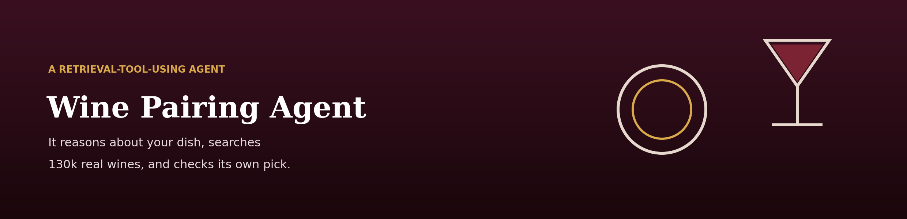
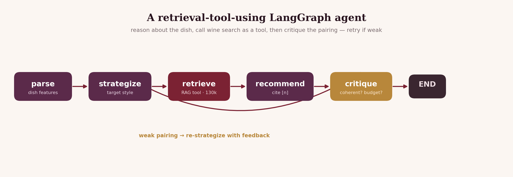

<p align="center">
  
</p>

# Wine Pairing Agent

Describe your meal — *"grilled ribeye with peppercorn sauce"*, *"spicy Thai green
curry"* — and a **LangGraph agent** reasons from sommelier pairing principles to
the right wine *style*, searches a database of **130,000 real wine reviews** for
matching bottles, recommends with citations, and **critiques its own pick** —
retrying with a different strategy if the pairing is weak or nothing fits your
budget.

> 🌐 **Overview:** https://lyhjeremy.github.io/wine-pairing-agent/

## The idea: RAG as a tool inside an agent
My [Wine Sommelier RAG](https://github.com/lyhjeremy/wine-sommelier-rag) answers
"find me a wine like X." This project puts that retrieval **inside an agent** that
first has to *figure out what style to even search for*. The agent doesn't just
retrieve — it reasons about the dish (body, fat, acid, spice), forms a pairing
strategy, uses retrieval as a **tool**, and then checks whether the result is
actually any good.

## The graph

<p align="center">
  
</p>

| Node | What it does |
|---|---|
| **parse** | Turns the free-text meal into structured features (main, body, sauce, cuisine, flavours) |
| **strategize** | Reasons from pairing principles → a target wine style + a search query |
| **retrieve** | **Tool call:** semantic search over 130k real reviews (with a budget filter) |
| **recommend** | Picks 1–2 bottles and explains the pairing logic, cited `[n]` |
| **critique** | Checks candidate count, budget, and pairing coherence — loops back to `strategize` with feedback if weak |

If the first strategy retrieves too few wines or the critique judges the pairing
off, the agent **re-strategizes** (a different style or broader query) and tries
again, up to an attempt budget.

## Quick start
```bash
pip install -r requirements.txt

python fetch_data.py            # download the ~130k-review dataset -> data/
python -m src.ingest --limit 30000   # build the wine index the agent searches

python -m src.cli "grilled ribeye with peppercorn sauce" --budget 40
python -m src.cli "spicy Thai green curry" --budget 25 --color white
python -m src.cli                # interactive
```
Generation runs on the **Claude CLI** by default (your Claude subscription, no
per-token cost); set `ANTHROPIC_API_KEY` to use the API. Retrieval is local & free.

## Observability: trace every run
`retrieve` is a real LangChain **`StructuredTool`** (`src/tools.py`) the agent
invokes by name, so runs are introspectable. Add `--trace` to time each node,
render a trace tree, and save the run as JSON under `traces/`:
```bash
python -m src.cli "grilled ribeye with peppercorn sauce" --budget 45 --trace
```
```text
AGENT TRACE  (node · time · detail)
────────────────────────────────────────────────────
  ● parse         1.2s   ribeye · rich body
  ● strategize    2.3s   style → full-bodied tannic red
  ● retrieve      0.3s   6 candidate wines (tool: search_wines)
  ● recommend     3.0s   drafted pairing with citations
  ● critique      2.2s   sound ✓
────────────────────────────────────────────────────
```
`python assets/make_trace_figure.py traces/last_run.json` renders it as a timeline
figure. When critique loops back to re-strategize, the extra pass shows up in the
trace — self-correction, made visible and measurable.

## Files
| Path | What it is |
|---|---|
| `src/graph.py` | The LangGraph agent: parse → strategize → retrieve → recommend → critique loop |
| `src/pairing.py` | The sommelier pairing principles the agent reasons with |
| `src/tools.py` | Wraps retrieval as a LangChain **StructuredTool** the agent invokes |
| `src/trace.py` | Lightweight run tracer — times each node, renders a tree, saves JSON (`--trace`) |
| `src/retriever.py` | Semantic search over the 130k-review index |
| `src/ingest.py` | Build the wine index (embeddings → Chroma) |
| `src/embedder.py` | Local sentence-transformers embedder (free, offline) |
| `src/llm.py` | LLM wrapper — Claude CLI (default) or Anthropic API |
| `src/cli.py` | Collect the meal, run the agent, print the pairing + agent trace |

## Notes
Ships **code only** — the dataset and index are built locally and git-ignored.
Every run prints an **agent trace** so you can watch it reason, retrieve and
self-check. Recommendations come from professional reviews, for personal use.

## License
[MIT](LICENSE) © 2026 Jeremy Lee
